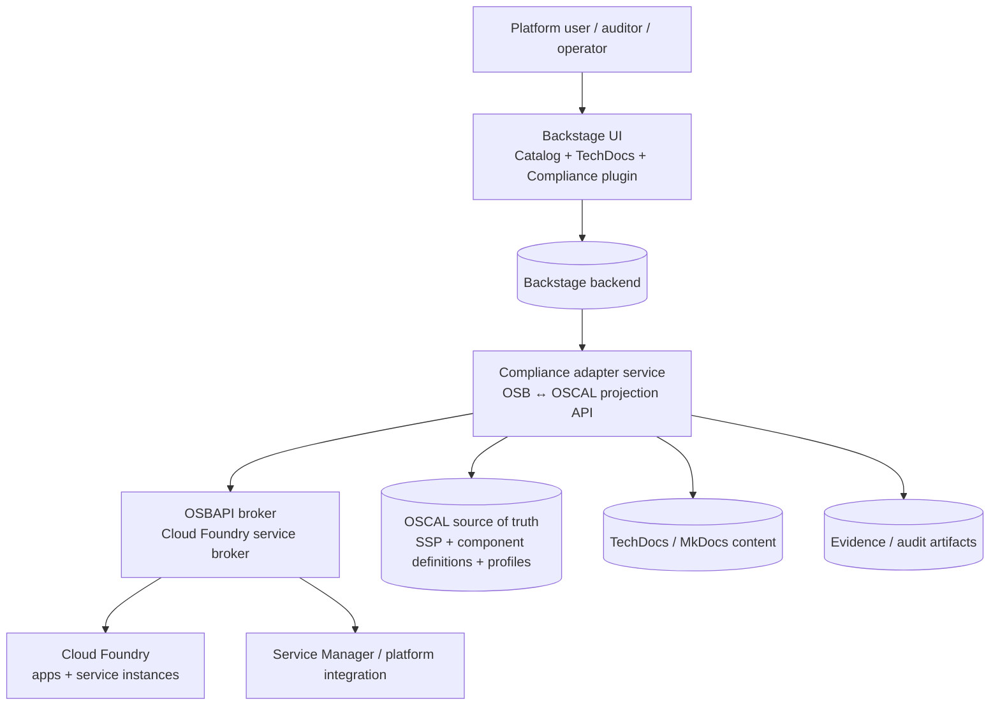
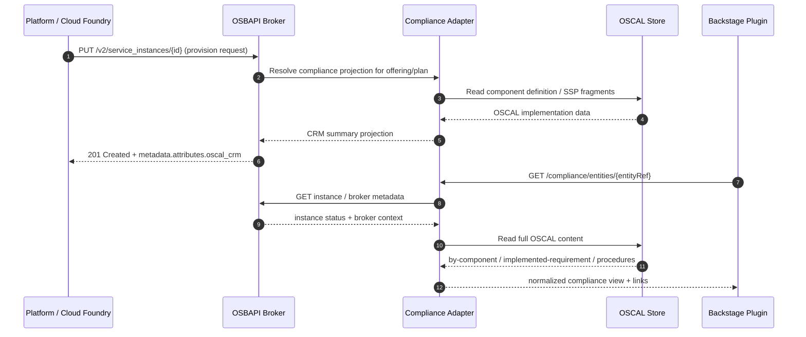
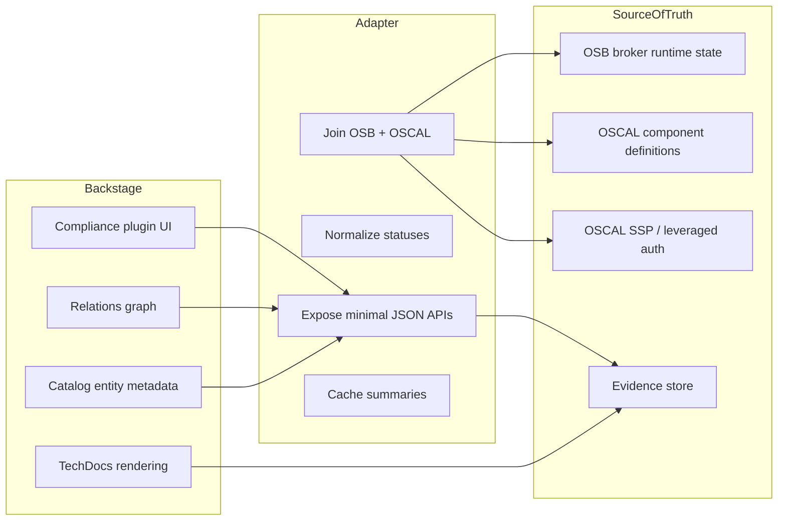
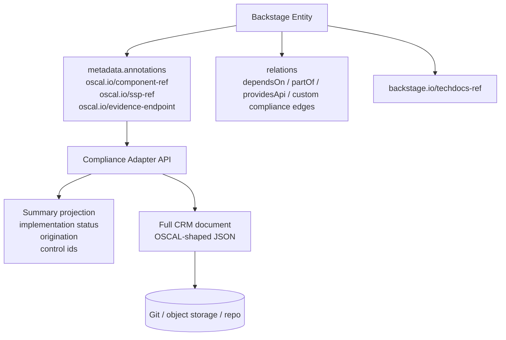

# OSBAPI ↔ OSCAL ↔ Backstage Architecture

## Context

```mermaid
flowchart TB
    Dev[Platform user / auditor / operator] --> BS[Backstage UI
Catalog + TechDocs + Compliance plugin]
    BS --> BSB[(Backstage backend)]
    BSB --> ADP[Compliance adapter service
OSB ↔ OSCAL projection API]
    ADP --> BROKER[OSBAPI broker
Cloud Foundry service broker]
    BROKER --> CF[Cloud Foundry
apps + service instances]
    ADP --> OSCAL[(OSCAL source of truth
SSP + component definitions + profiles)]
    ADP --> DOCS[(TechDocs / MkDocs content)]
    ADP --> EVID[(Evidence / audit artifacts)]
    BROKER --> SM[Service Manager / platform integration]
```

## Runtime interactions

```mermaid
sequenceDiagram
    autonumber
    participant P as Platform / Cloud Foundry
    participant B as OSBAPI Broker
    participant A as Compliance Adapter
    participant O as OSCAL Store
    participant T as Backstage Plugin

    P->>B: PUT /v2/service_instances/{id} (provision request)
    B->>A: Resolve compliance projection for offering/plan
    A->>O: Read component definition / SSP fragments
    O-->>A: OSCAL implementation data
    A-->>B: CRM summary projection
    B-->>P: 201 Created + metadata.attributes.oscal_crm

    T->>A: GET /compliance/entities/{entityRef}
    A->>B: GET instance / broker metadata
    B-->>A: instance status + broker context
    A->>O: Read full OSCAL content
    O-->>A: by-component / implemented-requirement / procedures
    A-->>T: normalized compliance view + links
```

## Responsibility split

```mermaid
flowchart LR
    subgraph Backstage
      C1[Catalog entity metadata]
      C2[Relations graph]
      C3[TechDocs rendering]
      C4[Compliance plugin UI]
    end

    subgraph Adapter
      A1[Join OSB + OSCAL]
      A2[Normalize statuses]
      A3[Expose minimal JSON APIs]
      A4[Cache summaries]
    end

    subgraph SourceOfTruth
      S1[OSB broker runtime state]
      S2[OSCAL component definitions]
      S3[OSCAL SSP / leveraged auth]
      S4[Evidence store]
    end

    C1 --> A3
    C2 --> A3
    C3 --> S4
    C4 --> A3
    A1 --> S1
    A1 --> S2
    A1 --> S3
    A3 --> S4
```

## Minimal data placement

```mermaid
flowchart TD
    E[Backstage Entity] --> AN[metadata.annotations
oscal.io/component-ref
oscal.io/ssp-ref
oscal.io/evidence-endpoint]
    E --> RL[relations
dependsOn / partOf / providesApi / custom compliance edges]
    E --> TD[backstage.io/techdocs-ref]

    AN --> API[Compliance Adapter API]
    API --> SUM[Summary projection
implementation status
origination
control ids]
    API --> FULL[Full CRM document
OSCAL-shaped JSON]
    FULL --> OSCALDOC[(Git / object storage / repo)]
```
